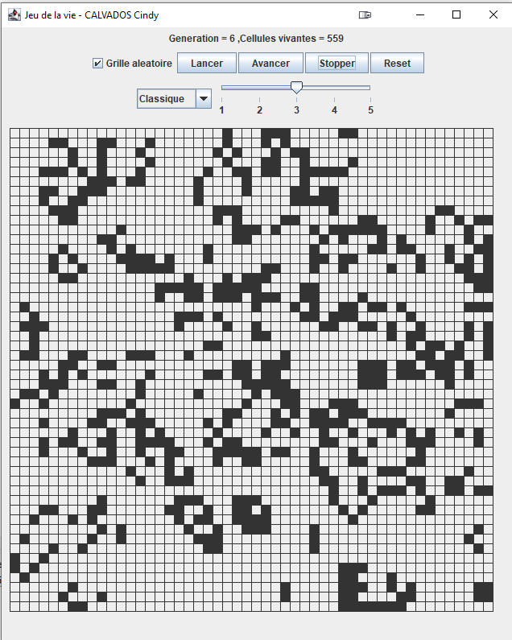

# Jeu de la vie ( Game of life )

Ce projet a été réalisé dans le cadre du module "Design Pattern" de la 3ème année de Licence Informatique (Le Mans Université).

### Objectifs du projet :
- Implémenter le principe du "Jeu de la vie" (aussi appelé "Atomate Cellulaire")
- Implémenter le jeu selon 5 Design Patterns :
  - Etat (State)
  - Singleton
  - Observateur (Observer)
  - Commande (Command)
  - Visiteur (Visitor)

### Technologies utilisées :
- Java,
- Swing pour l'interface graphique.

### Règles :
Un automate cellulaire est un objet mathématique qui permet de simuler l’évolution d’une population de cellules virtuelles au cours du temps, selon des règles de voisinage (règles classiques mais il existe des règles alternatives) :

- Si une cellule possède moins de 2 voisines, elle meurt;
- Si une cellule possède plus de 3 voisines, elle meurt aussi;
- Si un emplacement vide (ou cellule morte) possède 3 voisines (vivantes), une nouvelle cellule naît.

### Fonctionnalités implémentées :

- Création de cellules par clic de souris
- Activation/désactivation génération aléatoire de cellules.
- Affichage textuel de la génération en cours et du nombre de cellules vivantes ;
- Ajustement de la vitesse de génération avec un slider (accélérer ou ralentir) ;
- Possibilité de changer les règles à appliquer ;
- Boutons pour l’exécution et l’arrêt de la boucle de génération du jeu ;
- Bouton pour avancer « pas à pas » ou de « génération en génération » ;
- Bouton de réinitialisation de la grille

### Lancement de l'application :
Pour lancer l’application, il suffit d’exécuter en double-cliquant sur le fichier : JeuDeLaVie.jar

Si cela ne fonctionne pas, ouvrir un terminal et taper la commande : java -jar JeuDeLaVie.jar

( Si par hasard vous avez une erreur de type : A JNI Error has occurred..., cela signifie que votre version de java est incompatible avec celle-ci utilisé pour le build.
Il vous faudra donc recompiler un .jar)
